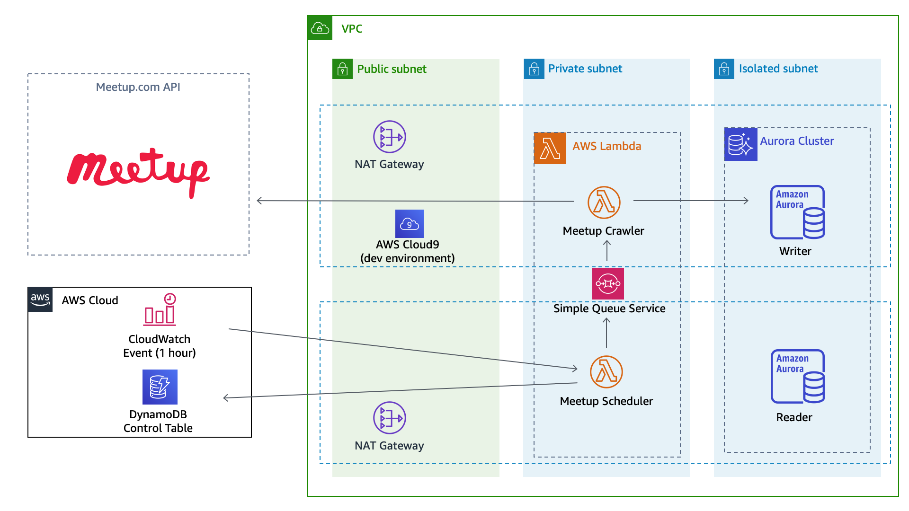

# Meetup Crawler 

This is a Meetup Data Crawler. The goal of the project is to collect AWS User's Group data from meetup.com for analytics purposes.  Data collected are the ones available through the public API of meetup.com, it includes data such as the number of members, the number of events organised, the number of rsvp per event etc.

--- 

**WARNING** 

Using Meetup's API and Data is subject to Meetup.com [License Agreement](https://help.meetup.com/hc/en-us/articles/360028705532-Meetup-API-license-terms). Please be sure you read and understand this license agreement before to use the code found here.

---

The two main pieces of code are a Scheduler and a Crawler.  Both are implemented as AWS Lambda functions.  The scheduler triggers at regular time interval and selects the User Group(s) data to crawl. The Scheduler posts a message containing the reference(s) to the meetup group(s) to refresh over SQS.  When the crawler receives a message, it queries Meetup.com APIs and store the data in a relational database for downstream analytics.

Project architecture is illustrated below.



There are two main deployment units in this project :

- `meetup-infra`is a CDK template that creates the infrastructure required by the Scheduler and the Crawler : a VPC network and the relational database (Aurora PostgreSQL)

- `meetup-crawler`is a SAM project that contains both the Meetup Scheduler and Meetup Crawler Lambda functions. It also creates some resources used by these : the SQS queues, the DynamoDB data control table and some Cloudwatch Alarms.

## Requirements

You need to have an AWS Account, and permissions to create all the services used. 

In addition, you need to have :

- python 3.8 (`brew install python@3.8`)
- pipenv (`brew install pipenv`)
- sam (`brew tap aws/tap && brew install aws-sam-cli`). This requires `docker`
- cdk (`npm install -g aws-cdk`)

## Contribute 

Please send your GitHub's username to [stormacq@amazon.com](mailto:stormacq@amazon.com?subject=I%20want%20to%20join%20the%20Meetup%20Crawler%20GitHub%20project) to be invited to the project.

Or send your [pull requests](https://github.com/sebsto/meetup-crawler/pulls).

## Data Model

If you rely on this project to create analytics solutions, here is the data model you can rely on.

### Group Table

This table contains the AWS User Group's details and their historical information. Each time the crawler run, a record is added to this table with the current data for the group. The record having the latest `last_updated_at` is the current record.

```text
                         Table "public.meetup_group"
         Column         |       Type        | Collation | Nullable | Default 
------------------------+-------------------+-----------+----------+---------
 id                     | bigint            |           |          | 
 name                   | character varying |           |          | 
 status                 | character varying |           |          | 
 link                   | character varying |           |          | 
 urlname                | character varying |           |          | 
 description            | character varying |           |          | 
 created                | bigint            |           |          | 
 city                   | character varying |           |          | 
 untranslated_city      | character varying |           |          | 
 country                | character varying |           |          | 
 localized_country_name | character varying |           |          | 
 localized_location     | character varying |           |          | 
 region2                | character varying |           |          | 
 state                  | character varying |           |          | 
 join_mode              | character varying |           |          | 
 visibility             | character varying |           |          | 
 lat                    | numeric           |           |          | 
 lon                    | numeric           |           |          | 
 members                | bigint            |           |          | 
 member_pay_fee         | boolean           |           |          | 
 timezone               | character varying |           |          | 
 last_updated_at        | bigint            |           |          | 
 raw_json               | json              |           | not null | 
```

### Group View

This is a view built on the 'Group Table'. It only shows the latest record for each group.

The list of columns and their respective data types is the same as the Group Table.

The view is defined as:
```text 
CREATE OR REPLACE VIEW meetup_group_latest AS
    SELECT * 
    FROM meetup_group AS MG
    WHERE last_updated_at = (SELECT max(last_updated_at) FROM meetup_group WHERE MG.id = id);  
```

### Event Table 

This table contains the events organised by each group. It only tracks events in the past. As such, an event does not change once inserted into that table.

```text
                            Table "public.meetup_event"
            Column            |       Type        | Collation | Nullable | Default 
------------------------------+-------------------+-----------+----------+---------
 id                           | character varying |           | not null | 
 utc_offset                   | bigint            |           |          | 
 rsvp_limit                   | bigint            |           |          | 
 headcount                    | bigint            |           |          | 
 visibility                   | character varying |           |          | 
 waitlist_count               | bigint            |           |          | 
 created                      | bigint            |           |          | 
 maybe_rsvp_count             | bigint            |           |          | 
 description                  | character varying |           |          | 
 why                          | character varying |           |          | 
 how_to_find_us               | character varying |           |          | 
 event_url                    | character varying |           |          | 
 yes_rsvp_count               | bigint            |           |          | 
 name                         | character varying |           |          | 
 time                         | bigint            |           |          | 
 duration                     | bigint            |           |          | 
 updated                      | bigint            |           |          | 
 photo_url                    | character varying |           |          | 
 fee_amount                   | bigint            |           |          | 
 fee_accepts                  | character varying |           |          | 
 fee_description              | character varying |           |          | 
 fee_currency                 | character varying |           |          | 
 fee_label                    | character varying |           |          | 
 fee_required                 | character varying |           |          | 
 venue_country                | character varying |           |          | 
 venue_localized_country_name | character varying |           |          | 
 venue_city                   | character varying |           |          | 
 venue_state                  | character varying |           |          | 
 venue_address_1              | character varying |           |          | 
 venue_address_2              | character varying |           |          | 
 venue_name                   | character varying |           |          | 
 venue_lon                    | numeric           |           |          | 
 venue_id                     | bigint            |           |          | 
 venue_lat                    | numeric           |           |          | 
 venue_repinned               | boolean           |           |          | 
 venue_phone                  | character varying |           |          | 
 venue_zip                    | character varying |           |          | 
 rating_count                 | bigint            |           |          | 
 rating_average               | bigint            |           |          | 
 group_join_mode              | character varying |           |          | 
 group_created                | bigint            |           |          | 
 group_name                   | character varying |           |          | 
 group_group_lon              | numeric           |           |          | 
 group_id                     | bigint            |           |          | 
 group_urlname                | character varying |           |          | 
 group_group_lat              | numeric           |           |          | 
 group_who                    | character varying |           |          | 
 last_updated_at              | bigint            |           |          | 
 raw_json                     | json              |           | not null | 
Indexes:
    "meetup_event_pkey" PRIMARY KEY, btree (id)
```

## Deployment

To deploy this project on your own account, follow the below instructions.

### Get the Sources

Open a Terminal and download the project sources :

```zsh
git clone https://github.com/sebsto/meetup-crawler.git
cd meetup-crawler
```

### Infrastructure 

1. Create a virtual environment for `meetup-infra` :

    ```zsh 
    cd meetup-infra
    pipenv --python 3.8
    ```

2. Install dependencies for meetup-infra

    ```zsh 
    pipenv install # or pipenv install --skip-lock  
    pipenv shell 
    ```

3. Define the AWS Region where you want to deploy

    Open `conf/config.dev.json` and update the following, as appropriate:

    ```json
    "env": {
            "region": "eu-west-3"
        }
    ```

4. Deploy the infra 

    ```zsh
    # verify everything works well first 
    cdk -c env=dev|prod ls

    # then deploy in env or prod environment
    cdk boostrap # first time only 
    cdk deploy -c env=dev|prod "*"
    ```

    Take note of the output (in blue). **These are scattered accross different places, and not just at the end of the cdk command output.** Think about scrolling up a bit to find them.

    ```text 
    meetup-infra-dev-vpc.ExportsOutputRefmeetupcrawlervpclambdaSubnet2Subnet6115C64F27ACAA43 = subnet-08da2cf1dde91f6b7
    meetup-infra-dev-vpc.ExportsOutputRefmeetupcrawlervpclambdaSubnet1SubnetD2F8FB9BB48114F7 = subnet-0152aef7b05d84741
    meetup-infra-dev-rds.DBSECURITYGROUPS = sg-081e76a970175a030
    meetup-infra-dev-rds.DBSECRETNAME = arn:aws:secretsmanager:eu-west-3:486652066693:secret:meetupcrawlerdatabaseSecret-FOZiyZaygjzV-f588bT
    ```

    It is possible to query the outputs using :

    ```zsh
    aws cloudformation describe-stacks --region eu-west-3 --stack-name meetup-infra-dev-vpc --query "Stacks[0].Outputs[]"
    aws cloudformation describe-stacks --region eu-west-3 --stack-name meetup-infra-dev-rds --query "Stacks[0].Outputs[]"
    ```

### (optional) Verify the deployment was succesful

Go to the EC2 console and locate the EC2 instance hosting your Cloud9 environment.

Add the Security Group of the database to the EC2 instance to allow the instance to connect to the database. The Security group ID is in the output of the cdk command (`meetup-infra-dev-rds.DBSECURITYGROUPS = sg-081e76a970175a030` in the example above)

Go to the Cloud9 console and open the IDE created for you and **open a Cloud9 Terminal**

```zsh

brew instal postgres@11 pipenv
sudo yum install jq -y

echo 'export PATH="/home/linuxbrew/.linuxbrew/opt/postgresql@11/bin:$PATH"' >> /home/ec2-user/.bash_profile
echo 'export LDFLAGS="-L/home/linuxbrew/.linuxbrew/opt/postgresql@11/lib"' >> /home/ec2-user/.bash_profile
echo 'export CPPFLAGS="-I/home/linuxbrew/.linuxbrew/opt/postgresql@11/include"' >> /home/ec2-user/.bash_profile
echo 'export PKG_CONFIG_PATH="/home/linuxbrew/.linuxbrew/opt/postgresql@11/lib/pkgconfig"' >> /home/ec2-user/.bash_profile
. ~/.bash_profile 

# you will need to authenticate with your github username / password 
git clone https://github.com/sebsto/meetup-crawler.git

cd meetup-crawler/meetup-crawler
```

Edit `./script/connectdb.sh` and update `AWS_REGION` and `SECRET_ID`.  
`SECRET ID` is available from the CDK Stack output above.  In my example:

```text
meetup-infra-dev-rds.DBSECRETNAME = arn:aws:secretsmanager:eu-west-3:486652066693:secret:meetupcrawlerdatabaseSecret-FOZiyZaygjzV-f588bT
```

Finally, try to connect to the database:

```zsh
./script/connectdb.sh
```

Once connected to the database, verify that the tables and view have been created:

```text
meetupcrawler=> \dt
           List of relations
 Schema |     Name     | Type  | Owner  
--------+--------------+-------+--------
 public | meetup_event | table | dbuser
 public | meetup_group | table | dbuser
(2 rows)

meetupcrawler=> \dv
              List of relations
 Schema |        Name         | Type | Owner  
--------+---------------------+------+--------
 public | meetup_group_latest | view | dbuser
(1 row)
```

### Meetup Scheduler and Meetup Crawler 

Before deploying the meetup scheuler and meetup crawlers lambda functions, you have to collect some IDs of the resources just created.

1. Prepare the SAM Template 

    Back to your laptop, in a Terminal, type:

    ```zsh
    # Assuming your terminal is still in meetup-reporting/meetup-infra directory :
    cd ../meetup-crawler

    # Set the two values below
    AWS_REGION= # type the region name where you deployed the infrastructure, for example 'eu-west-3'
    YOUR_EMAIL=notify@me.com # change the email address

    ENV=dev # or prod 

    LAMBDA_SUBNETS=$(aws cloudformation describe-stacks --region $AWS_REGION --stack-name meetup-infra-$ENV-vpc --query "Stacks[0].Outputs[?contains(ExportName,'vpclambdaSubnet')].OutputValue" --out text | python -c 'import sys; print(sys.stdin.read().replace("\t",","))')
    echo $LAMBDA_SUBNETS
    # shorter version ==> | perl -pe 's/\t\,/g'

    SECURITY_GROUP=$(aws cloudformation describe-stacks --region $AWS_REGION --stack-name meetup-infra-$ENV-rds --query "Stacks[0].Outputs[?ExportName=='db-security-groups-$ENV'].OutputValue" --out text)
    echo $SECURITY_GROUP

    SECRET_ARN=$(aws cloudformation describe-stacks --region $AWS_REGION --stack-name meetup-infra-$ENV-rds --query "Stacks[0].Outputs[?ExportName=='db-secret-name-$ENV'].OutputValue" --out text)
    echo $SECRET_ARN

    sed -i .bak -e "s/<<ALERT_EMAIL>>/$YOUR_EMAIL/g" -e "s/<<SUBNET_IDS>>/$LAMBDA_SUBNETS/g" -e "s/<<SECURITY_GROUP>>/$SECURITY_GROUP/g" -e "s/<<SECRET_ARN>>/$SECRET_ARN/g" template.yaml
    ```

2. (optional) Create a virtual environment for meetup-crawler and install dependencies

    If you plan to locally modify and test the code, you have to create a virtual environment to run it, and install the code dependencies.

    ```zsh 
    # in meetup-crawler directory (PROJECT/meetup-reporting/meetup-crawler)

    pipenv --python 3.8
    pipenv install # or pipenv install --skip-lock  
    pipenv shell 
    ```

3. Deploy the crawler

    ```zsh
    # The first time 
    sam build && sam deploy --guided 

    # for subsequent deployments 
    sam build && sam deploy --stack-name meetup-crawler-dev
    ```

    For production deployments :

    ```zsh
    sam build && sam deploy --stack-name meetup-crawler-prod --parameter-overrides Env=prod
    ```

    The scheduler Lambda fuction will automatically populate the DynamoDB table at first run, it will also send one SQS message per group to the crawler function.  To avoid hitting the Meetup.com API rate limit, it spreads the message availability over 15 minutes. So the initial collection of data will happen within 15 minutes after the first execution of the scheduler Lambda function.

    **Important !**
    Because the Scheduler is first triggered 1h after deployment, the above process starts one hour after the deployment.  To start the process sooner, manually trigger the Scheduler Lambda function from the AWS Console.  

4. (optional) Local code execution

    If you plan to locally modify and test the code, you have to create a virtual environment to run it, and install the code dependencies.

    ```zsh 
    echo "AWS_REGION=$AWS_REGION" > .env
    echo "DB_SECRET_NAME=$SECRET_ARN" >> .env
    echo "PYTHON_LOGLEVEL=debug" >> .env
    echo "PYTHONPATH=./src" >> .env
    echo "SQS_QUEUE_NAME=$(aws cloudformation describe-stacks --region $AWS_REGION --stack-name meetup-crawler-$ENV --query "Stacks[0].Outputs[?ExportName=='SQS-QUEUE-NAME-$ENV'].OutputValue" --output text)" >> .env
    echo "DYNAMODB_TABLE_NAME=$(aws cloudformation describe-stacks --region $AWS_REGION --stack-name meetup-crawler-$ENV --query "Stacks[0].Outputs[?ExportName=='DYNAMODB-TABLE-NAME-$ENV'].OutputValue" --output text)" >> .env
    ```

    You can start the scheduler locally using 

    ```zsh 
    python -m meetupscheduler.app
    ````

    You can start the crawler locally by 

    1. Setting the group URL Name you want crawl in `events/event.json`
    2. Launching the code in your virtual environment with:
        ```zsh
        python -m meetupcrawler.app
        ```

## Logging 

When executing the code locally, the logs are sent to `stdout`.

When executing in a Lambda function, the logs are sent to AWS CloudWatch Logs.  You can use `sam`to tail the logs locally :

```zsh
AWS_REGION=eu-west-3
ENV=dev # or prod 

# Crawler logs 
sam logs --region $AWS_REGION --name MeetupCrawlerFunction --stack-name meetup-crawler-$ENV --tail

# Scheduler logs 
sam logs --region $AWS_REGION --name MeetupCrawlerSchedulerFunction --stack-name meetup-crawler-$ENV --tail
```

## SQL Statements for Analytics 

Here are the requirements to connect to the database, you must have:

- Secret Manager permission (`secretsmanager:GetSecretValue`) to read the database connection details (`$DB_SCRET_NAME`)
- a database client deployed to or having network access the database VPC
- the database client must be part of the DB Client Security Group (`$SECURITY_GROUP`)

Here are a couple of SQL statements that can be used for analytics.

### How many groups ?

```text
meetupcrawler=> select count(*) from meetup_group_latest;
 count 
-------
   357
(1 row)
````

### How many members has that group ?

```text
meetupcrawler=> select urlname, name, members from meetup_group_latest where urlname = 'French-AWS-UG';
    urlname    |         name         | members 
---------------+----------------------+---------
 French-AWS-UG | Paris AWS User Group |    3616
(1 row)
```

### What is the evolution of this group ?

```text
meetupcrawler=> select urlname, name, members, to_timestamp(last_updated_at) as when from meetup_group  where urlname = 'French-AWS-UG';                                                        
    urlname    |         name         | members |          when          
---------------+----------------------+---------+------------------------
 French-AWS-UG | Paris AWS User Group |    3616 | 2020-08-30 12:50:21+00
(1 row)
```

Mutiple lines will appear over time.

### How many groups are there in this country ?

```text
meetupcrawler=> select urlname, name, members, to_timestamp(last_updated_at) as when from meetup_group  where country = 'FR';
                 urlname                  |                    name                    | members |          when          
------------------------------------------+--------------------------------------------+---------+------------------------
 Bordeaux-Amazon-Web-Services             | Bordeaux AWS User Group                    |     691 | 2020-08-30 12:49:48+00
 AWS-User-Group-Strasbourg                | Strasbourg AWS User Group                  |     241 | 2020-08-30 12:49:58+00
 French-AWS-UG                            | Paris AWS User Group                       |    3616 | 2020-08-30 12:50:21+00
 Poitiers-AWS-User-Group                  | Poitiers AWS User Group                    |      22 | 2020-08-30 12:51:26+00
 Montpellier-Amazon-Web-Services          | Montpellier Amazon Web Services            |     544 | 2020-08-30 12:51:44+00
 Grenoble-AWS-User-Group                  | Grenoble AWS User Group                    |     144 | 2020-08-30 12:54:02+00
 Toulouse-Amazon-Web-Services             | Toulouse AWS User Group                    |    1092 | 2020-08-30 12:55:02+00
 Marseille-AWS-User-Group                 | Marseille AWS User Group                   |     154 | 2020-08-30 12:55:43+00
 Pau-AWS-User-Group                       | Pau AWS User Group                         |      82 | 2020-08-30 12:55:47+00
 Rennes-Amazon-Web-Services-User-Group    | Rennes Amazon Web Services User Group      |     381 | 2020-08-30 12:59:57+00
 Lille-AWS-Amazon-Web-Services-User-Group | Lille AWS (Amazon Web Services) User Group |     673 | 2020-08-30 12:58:28+00
 AWS-Nantes                               | AWS Nantes                                 |     743 | 2020-08-30 12:59:20+00
 AWS-Lyon-Amazon-Web-Services-User-Group  | Lyon AWS User Group - LAWS                 |     685 | 2020-08-30 13:00:25+00
 AWS-cote-dAzur                           | AWS Côte d'Azur                            |     384 | 2020-08-30 13:04:14+00
 AWS-User-Group-Niort                     | Niort AWS User Group                       |      77 | 2020-08-30 13:04:14+00
 Bordeaux-Amazon-Web-Services             | Bordeaux AWS User Group                    |     691 | 2020-08-30 15:03:37+00
 AWS-User-Group-Strasbourg                | Strasbourg AWS User Group                  |     241 | 2020-08-30 20:03:38+00
(17 rows)
```

### How many events this group organised ?

1. All events ever organised 

```text
meetupcrawler=> select name, to_timestamp(time/1000), yes_rsvp_count from meetup_event where group_urlname = 'French-AWS-UG' order by time;                                                     
                                       name                                       |      to_timestamp      | yes_rsvp_count 
----------------------------------------------------------------------------------+------------------------+----------------
 Tenue du Meetup #1 du French AWS User Group le 26 juin                           | 2014-06-26 17:00:00+00 |             22
 Retour de Re:Invent                                                              | 2014-12-08 18:00:00+00 |             44
 3ème #MeetupAWS                                                                  | 2015-02-25 18:00:00+00 |             20
 4ème #MeetupAWS                                                                  | 2015-03-27 18:00:00+00 |             32
 Meetup #5 AWSFR le Mercredi 6 Mai chez NEOXIA                                    | 2015-05-06 17:00:00+00 |             32
 6ème #MeetupAWS                                                                  | 2015-06-10 16:30:00+00 |             33
 ...
 Meetup virtuel AWS #1 - AWS dans l'univers du Gaming                             | 2020-03-25 17:50:00+00 |            236
 Meetup virtuel AWS #2 - L'orchestration Kubernetes sur AWS                       | 2020-04-23 16:50:00+00 |            321
 Meetup virtuel AWS #3 - Migration et transformation d'une app                    | 2020-05-07 16:00:00+00 |            146
 Meetup virtuel AWS #4 - La sécurité dans le cloud AWS                            | 2020-05-27 17:00:00+00 |            187
 AWS Virtual Meetup #5 - Chaos engineering                                        | 2020-07-01 17:00:00+00 |            161
(49 rows)
```

2. Last month 

```text
select name, to_timestamp(time/1000), yes_rsvp_count
from meetup_event
where group_urlname = 'French-AWS-UG' and time/1000 >= extract(epoch from now()) - 2629743
order by time;
```

(2629743 is 1 month for epoch). For multiple months, just multiply this number by the number of months.

```text
meetupcrawler=> select name, to_timestamp(time/1000), yes_rsvp_count from meetup_event where group_urlname = 'French-AWS-UG' and time/1000 >= extract(epoch from now()) - (3*2629743) order by time;
                   name                    |      to_timestamp      | yes_rsvp_count 
-------------------------------------------+------------------------+----------------
 AWS Virtual Meetup #5 - Chaos engineering | 2020-07-01 17:00:00+00 |            161
(1 row)
```

3. Last year 

```text
meetupcrawler=> select name, to_timestamp(time/1000), yes_rsvp_count from meetup_event where group_urlname = 'French-AWS-UG' and time/1000 >= extract(epoch from now()) - 31556926  order by time;
                                       name                                       |      to_timestamp      | yes_rsvp_count 
----------------------------------------------------------------------------------+------------------------+----------------
 Use Machine Learning to personalise customer content & to make business forecast | 2019-09-03 16:45:00+00 |             66
 Meetup AWS #38                                                                   | 2019-11-12 17:45:00+00 |             90
 Meetup AWS #39 - re:Invent 2019 re:Cap                                           | 2019-12-18 18:00:00+00 |            249
 Meetup AWS #40 - Serverless                                                      | 2020-01-30 17:45:00+00 |             70
 Meetup AWS #41 - Container on AWS                                                | 2020-02-17 17:45:00+00 |            140
 Meetup virtuel AWS #1 - AWS dans l'univers du Gaming                             | 2020-03-25 17:50:00+00 |            236
 Meetup virtuel AWS #2 - L'orchestration Kubernetes sur AWS                       | 2020-04-23 16:50:00+00 |            321
 Meetup virtuel AWS #3 - Migration et transformation d'une app                    | 2020-05-07 16:00:00+00 |            146
 Meetup virtuel AWS #4 - La sécurité dans le cloud AWS                            | 2020-05-27 17:00:00+00 |            187
 AWS Virtual Meetup #5 - Chaos engineering                                        | 2020-07-01 17:00:00+00 |            161
(10 rows)
```

### How many rsvp had this group's events ?

1. for all events ever organised by this group

```text
meetupcrawler=> select sum(yes_rsvp_count) from meetup_event where group_urlname = 'French-AWS-UG';
 sum  
------
 4475
(1 row)
```

2. Last month 

The below example is for 3 months

```text
meetupcrawler=> select sum(yes_rsvp_count) from meetup_event where group_urlname = 'French-AWS-UG' and time/1000 >= extract(epoch from now()) - (3*2629743);
 sum 
-----
 161
(1 row)
```

3. Last year 

```text
meetupcrawler=> select sum(yes_rsvp_count) from meetup_event where group_urlname = 'French-AWS-UG' and time/1000 >= extract(epoch from now()) - (31556926);
 sum  
------
 1666
(1 row)
```
